# F1TelemetryData

## 👀 What is it?
F1 Telemetry Data is my biggest and most successful project so far.

I wrote a framework to take raw telemetry data for each F1 session, analyze it, and present it in nicely designed and intuitive graphs.

It also lets me automatically post to all my socials, including (for now) [Twitter/X](https://x.com/F1TelemetryData), [Telegram](https://t.me/F1TelemetryData), [Instagram](https://instagram.com/F1TelemetryData) and the [r/formula1](https://reddit.com/r/formula1/search?q=author:pesaventofilippo&restrict_sr=1&sort=new) subreddit.

## 💻 Tech Stack
- **Language**: Python 3
- **Raw telemetry**: [Fast-F1](https://github.com/theOehrly/Fast-F1) and [Jolpica-F1](https://github.com/jolpica/jolpica-f1)
- **Data analysis**: Pandas
- **Graphics**: Heavily modified matplotlib and Seaborn

## 📊 Stats
- ±40 graphs made each race weekend
- 9200+ followers on Twitter
- 1200+ followers on Telegram
- 400+ followers on Instagram

## 🏆 Featured on
- Sky Italia (on TV)
- [Motorsport.com Italia](https://it.motorsport.com/)
- [F1inGenerale](https://f1ingenerale.com/)
- [PaddockNews24](https://paddocknews24.com/author/pesaventofilippo)
- ...and many others on the web!

## 🏞️ Gallery

  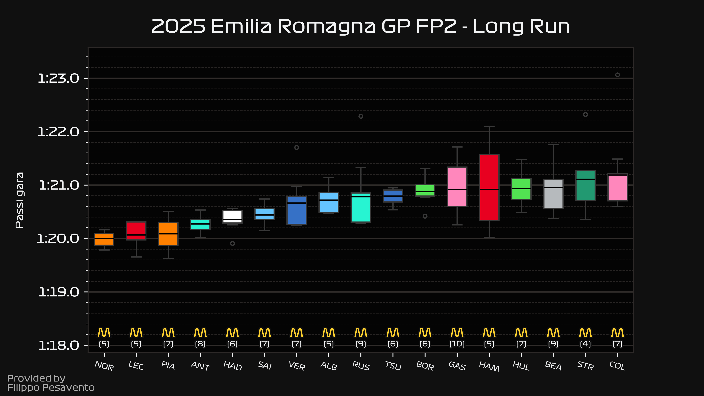
  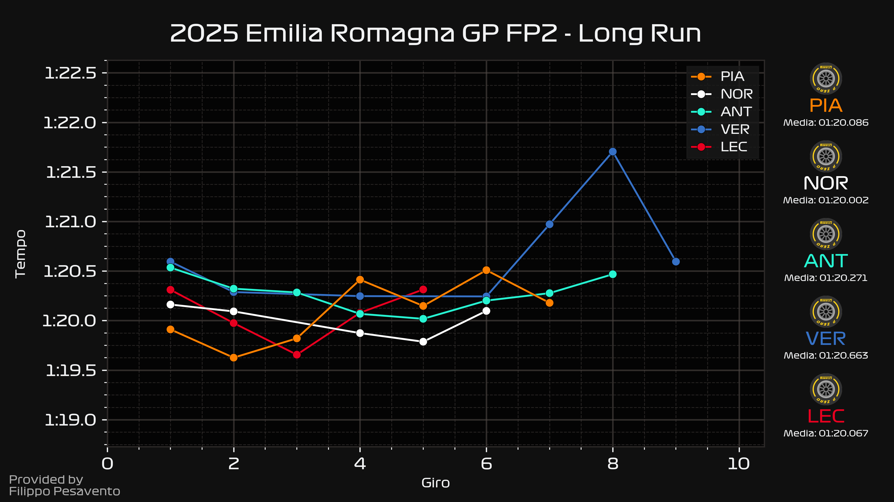
  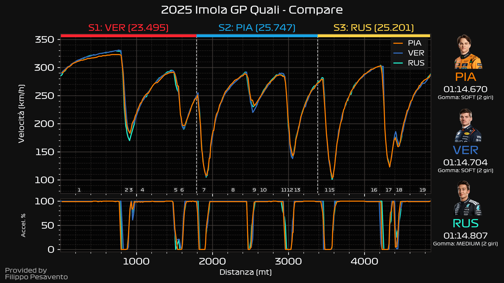
  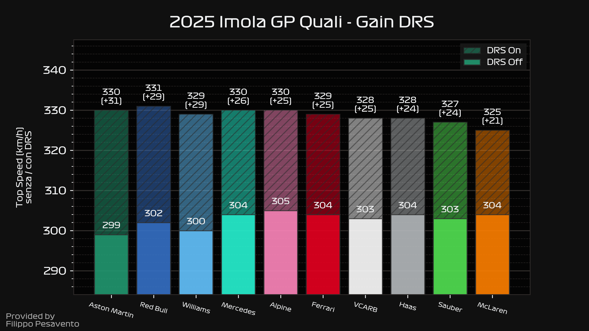
  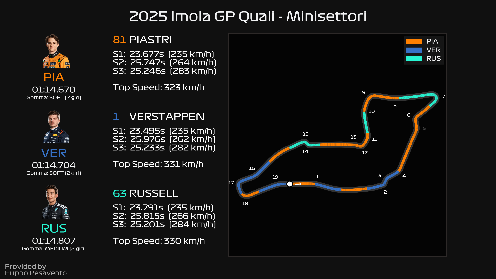
  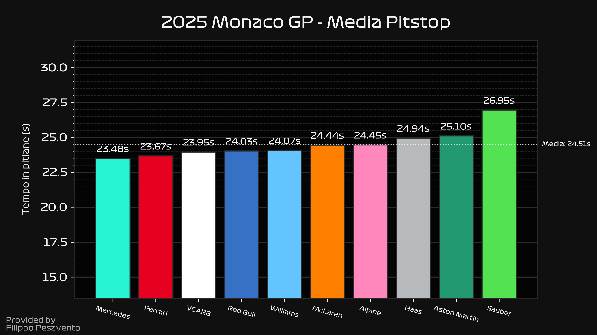
  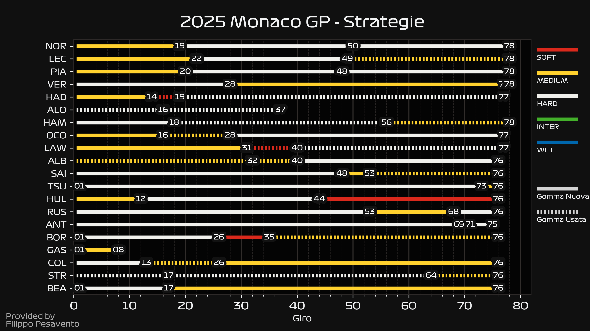
  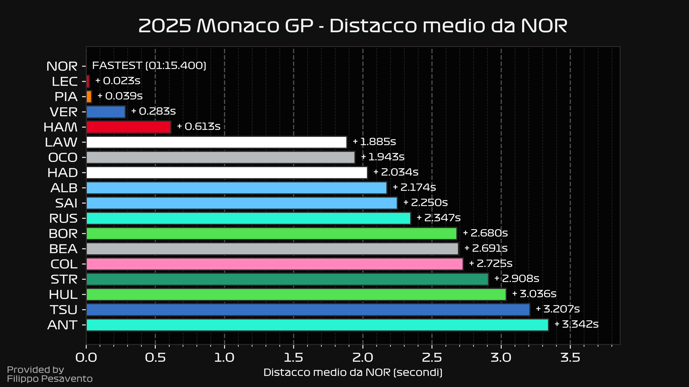
  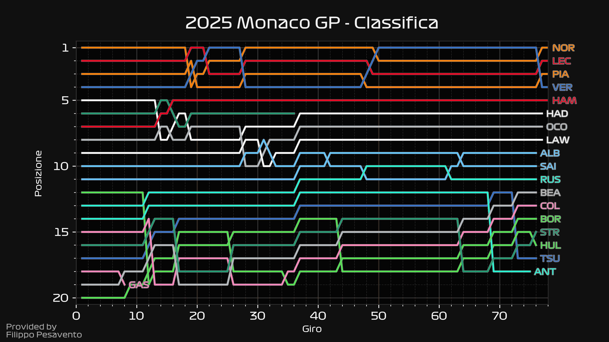
  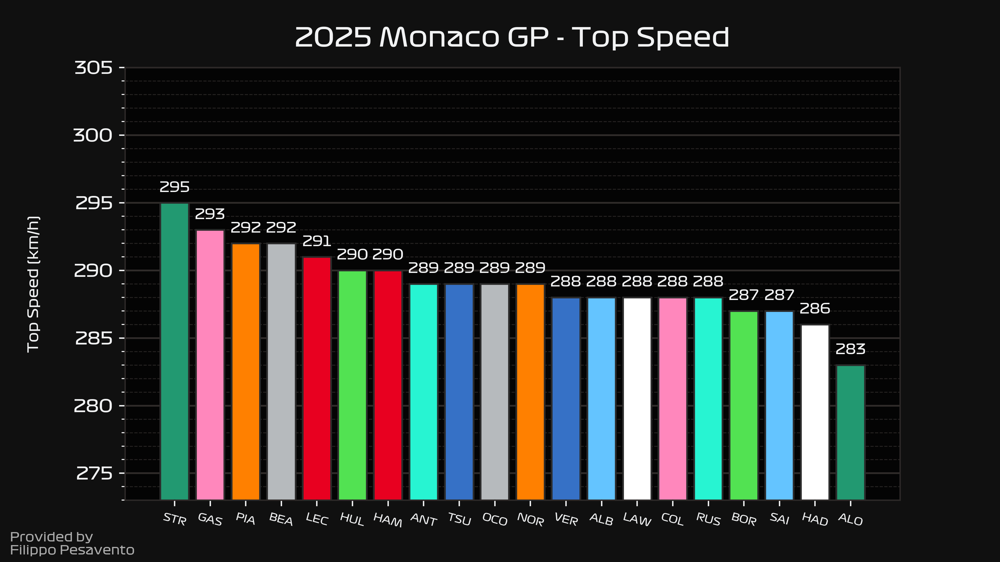
  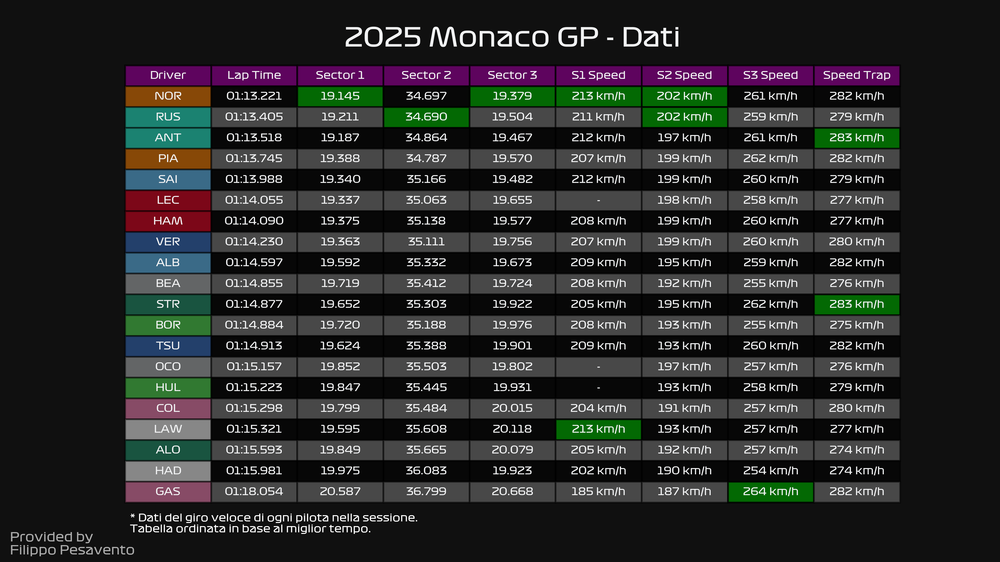
  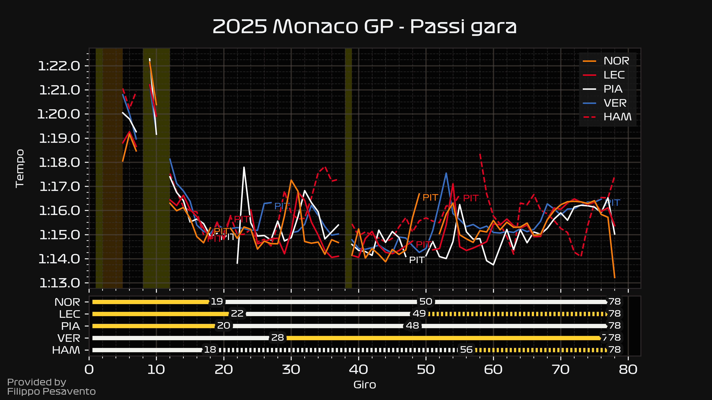

